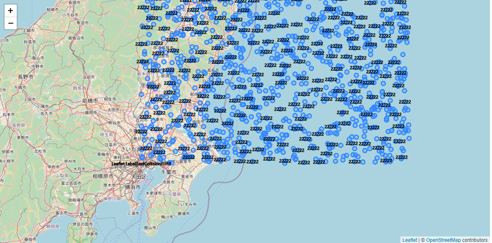

# Leaflet-CanvasLabel

思路来自于[Leaflet.LabelTextCollision](https://github.com/yakitoritabetai/Leaflet.LabelTextCollision)，非常好的思路，但是实现的太糟糕了。

Leaflet-CanvasLabel ，用于在矢量数据上显示标签，样式设置基于Canvas标准，还提供了偏移，缩放，旋转，指定显示位置等设置参数。

同时为了避免标签重叠，插件隐藏了一些标签，可以通过参数`collisionFlg`为`false`禁用碰撞检测。标签显示顺序为 collisionFlg=false优先collisionFlg=true，zIndex大的优先zIndex小的。

## npm下载

```bash
npm i @panzhiyue/leaflet-canvaslabel
```

## 使用

```javascript
import {CanvasLabel} from "@panzhiyue/leaflet-canvaslabel"
```


## 语法

```javascript
    //定义渲染器
	var canvasLabel = new L.CanvasLabel({
      defaultLabelStyle: labelStyleOptions
    });

    //定义矢量
	var polygon=L.polygon(latLngs,{
        labelStyle:labelStyleOptions
    })
```


## 示例 

```javascript
    //矢量文本标签渲染器
    var canvasLabel = new L.CanvasLabel({
      collisionFlg: true,
      scale: 2
    });

    //定义地图
    var map = L.map('map', {
      renderer: canvasLabel
    }).setView([35.695786, 139.749213], 8);

    //添加OpenStreetMap底图
    var tiles = L.tileLayer('http://{s}.tile.osm.org/{z}/{x}/{y}.png', {
      attribution: '&copy; <a href="http://osm.org/copyright">OpenStreetMap</a> contributors',
      preferCanvas: true
    }).addTo(map);

    //添加矢量数据
    var p = L.polyline(
      [[[35.695786, 139.749213],
      [35.696786, 139.748213],
      [35.695786, 139.747213]], [[35.695786 + 0.1, 139.749213],
      [35.696786 + 0.1, 139.748213],
      [35.695786 + 0.1, 139.747213]]], {

      labelStyle: {
        text: 'Leaflet.LabelTextCollision!!!!!!!!',
        zIndex: 0,
        collisionFlg: false,
        zIndex: 0
      },
      color: '#fe57a1',
    }).addTo(map);


    for (let i = 0; i < 1000; i++) {
      let latlng = L.latLng(35.695786 + Math.random() * 1.8, 139.749213 + Math.random() * 3.6);
      let c = L.circleMarker(latlng, {
        radius: 5,
        labelStyle: {
          text: "22222",
          scale: 1,
          rotation: 0,
          zIndex: i
        }
      }).addTo(map);
    }
```

## 效果图



## LabelStyleOptions

| 名称                        | 类型                | 描述                                        |
| --------------------------- | ------------------- | ------------------------------------------- |
| **canvas参数**              |                     | https://www.runoob.com/tags/ref-canvas.html |
| font="10px sans-serif"      |                     |                                             |
| fillStyle="rgba(0,0,0,1)"   |                     |                                             |
| strokeStyle="rgba(0,0,0,1)" |                     |                                             |
| textAlign="center"          |                     |                                             |
| textBaseline="middle"       |                     |                                             |
| lineWidth=1                 | Number              |                                             |
| **其他参数**                |                     |                                             |
| offsetX=0                   | Number              | 横坐标偏移(像素)                            |
| offsetY=0                   | Number              | 纵坐标偏移(像素)                            |
| scale=1                     | Number              | 放大比例                                    |
| rotation=0                  | Number              | 旋转角度（弧度），可能会导致碰撞检测不准确  |
| text=null                   | String              | 标注文本内容                                |
| minZoom=null                | Number              | 最小显示级别                                |
| maxZoom=null                | Number              | 最大显示级别                                |
| collisionFlg=true           | Boolean             | 碰撞检测                                    |
| center=null                 | [lat,lng]\|L.LatLng | 标注位置，默认为null,会自动计算几何中心     |
| zIndex=0                    | Number              | 排序                                        |
| defaultHeight=20            | Number              | 文本高度,无法自动计算,所以直接传参手动调整  |

